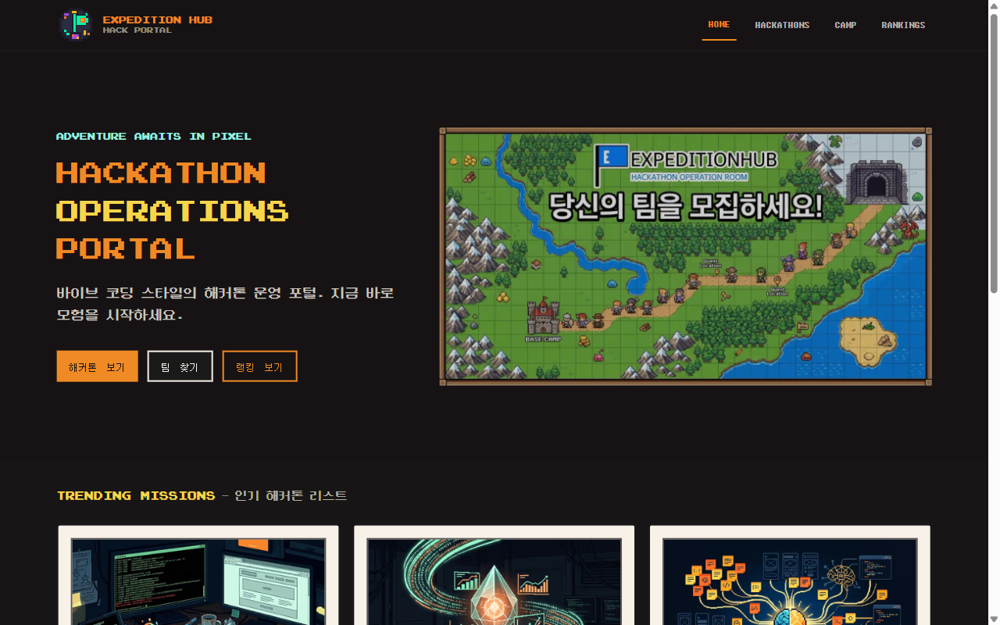
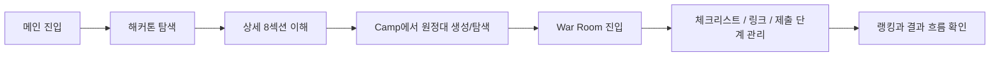
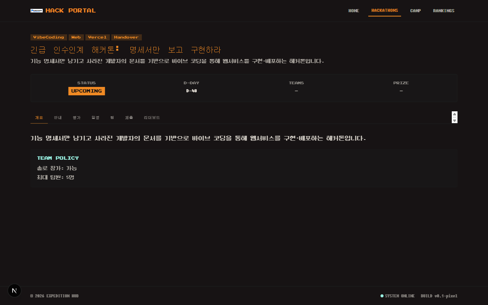
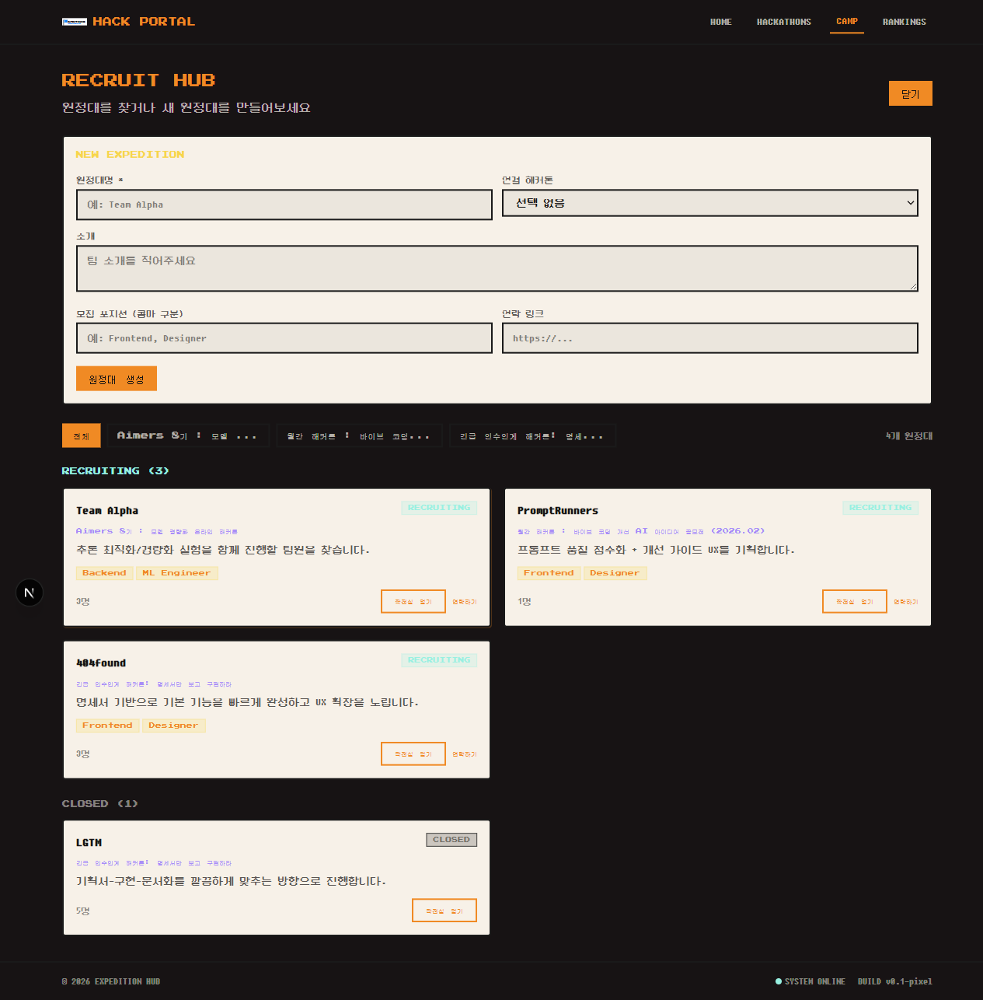
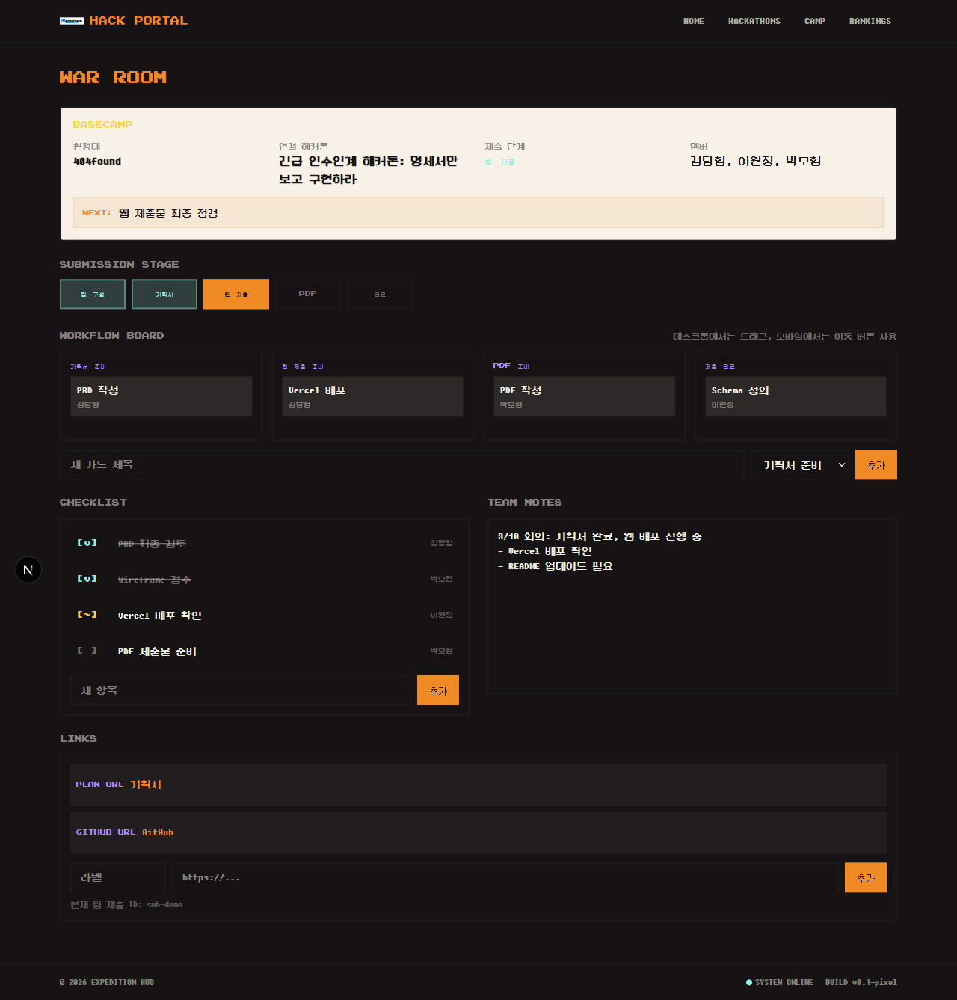

<div align="center">
  
  <h1>Expedition Hub</h1>
  <p><strong>원정대 구성부터 제출 준비 관리, 결과 확인까지 이어지는 재사용형 해커톤 운영 포털</strong></p>
  <p><strong>daker-handover-2026-03</strong> SSOT를 기준으로, 심사자가 배포 URL과 GitHub 저장소만으로도 서비스 가치와 구현 완성도를 빠르게 이해할 수 있게 정리한 제출형 프로젝트입니다.</p>
  <p>
    <a href="https://daykervibe.vercel.app/">Live Demo</a>
    ·
    <a href="https://github.com/kimjuyoung1127/daykervibe">GitHub</a>
    ·
    <a href="docs/ref/hackathons/daker-handover-2026-03.md">SSOT</a>
    ·
    <a href="docs/submission/deployment-evidence.md">배포 증빙</a>
    ·
    <a href="docs/submission/youtube-longform-production.md">제출 영상 가이드</a>
    ·
    <a href="docs/submission/video-scene-plan.md">씬별 영상 플랜</a>
  </p>

  
  
  
  
  
  
</div>

## 프로젝트 한눈에 보기

| 항목 | 내용 |
| --- | --- |
| 제품 정의 | 재사용 가능한 해커톤 운영 포털 |
| 핵심 흐름 | `탐색 -> 원정대 구성 -> 제출 준비 관리 -> 결과 이해` |
| 집중 대회 | `daker-handover-2026-03` |
| 구현 라우트 | `/`, `/hackathons`, `/hackathons/:slug`, `/camp`, `/rankings`, `/war-room/:teamId` |
| 저장 전략 | `localStorage` 우선, 외부 키 없는 검수 가능 상태 유지 |
| 제출 포인트 | 배포 URL, GitHub 저장소, PDF 자산, Remotion 기반 롱폼 영상 자산 |

> 이 저장소는 단순한 웹 구현 레포가 아니라, 문서와 화면과 제출 자산을 한 흐름으로 보여주는 심사 증빙 패키지입니다.

## 왜 만들었나

해커톤 참가자는 보통 대회 탐색, 팀 구성, 제출 준비, 결과 확인을 서로 다른 화면과 도구에서 처리합니다. 이 프로젝트는 그 단절을 줄이기 위해, 공개 포털과 팀 전용 실행 허브를 하나의 제품 안에서 연결했습니다.

심사자 관점에서도 같은 문제가 있습니다. 공개 URL 하나만 보고도 서비스 구조와 품질 관리 방식을 이해할 수 있어야 하므로, Expedition Hub는 구현과 동시에 문서, 증빙, 제출 자산까지 함께 정리하는 방향으로 설계했습니다.

## 핵심 사용자 흐름



## 심사 포인트 대응

| 심사 기준 | Expedition Hub 대응 |
| --- | --- |
| 기본 구현 30 | 핵심 6개 라우트, 상세 8섹션, 제출 상태, 랭킹, 공통 상태 UI |
| 확장(아이디어) 30 | Basecamp 요약, War Room 워크플로우 보드, 모집 역할 칩, public draft handoff |
| 완성도 25 | 반응형 정리, public/team-local 경계 보호, `localStorage` 기반 일관된 상태 유지 |
| 문서/설명 15 | SSOT, PRD, Schema, Wireframe, Architecture, daily log, submission assets 동기화 |

## 주요 화면

<table>
  <tr>
    <td></td>
    <td></td>
  </tr>
  <tr>
    <td align="center"><strong>메인 / 포털 진입</strong></td>
    <td align="center"><strong>상세 8섹션 / 제출 가이드</strong></td>
  </tr>
  <tr>
    <td></td>
    <td></td>
  </tr>
  <tr>
    <td align="center"><strong>Camp / 원정대 모집 허브</strong></td>
    <td align="center"><strong>War Room / 제출 준비 관리 허브</strong></td>
  </tr>
</table>

## 라우트 구성

| Route | 역할 | 심사자에게 보이는 가치 |
| --- | --- | --- |
| `/` | 해커톤 포털 진입점 | 서비스 한 줄 정의와 3개 주요 동선이 바로 드러남 |
| `/hackathons` | 해커톤 목록과 필터 | 탐색 흐름과 데이터 기반 렌더링 확인 가능 |
| `/hackathons/:slug` | 핵심 상세 페이지 | 규칙, 일정, 평가, 팀, 제출, 리더보드가 한 맥락에 정리됨 |
| `/camp` | 원정대 모집/생성 허브 | 팀 빌딩 UX와 확장 아이디어를 보여줌 |
| `/rankings` | 글로벌 랭킹 보드 | 결과 흐름과 서비스의 전체 맥락을 마무리함 |
| `/war-room/:teamId` | 팀 전용 제출 준비 허브 | 이 프로젝트의 가장 큰 확장 포인트이자 차별점 |

## 심사자용 검수 동선

1. `/`에서 서비스 한 줄 가치와 CTA 확인
2. `/hackathons`에서 목록/필터/상태 표현 확인
3. `/hackathons/daker-handover-2026-03`에서 8개 필수 섹션과 제출 구조 확인
4. `/camp`에서 팀 구성 흐름 확인
5. `/war-room/T-HANDOVER-01`에서 Basecamp, 카드 보드, 체크리스트, 링크 관리 확인
6. `/rankings`에서 결과 맥락과 공개 검수 흐름 마무리

## 기술 스택과 데이터 전략

- 프레임워크: `Next.js 16 App Router`
- 언어: `TypeScript`
- 스타일링: `Tailwind CSS v4`
- 상태 저장: `localStorage`
- 배포: `Vercel`
- 데이터 소스: `hackathonsjson/*.json` + 브라우저 로컬 상태

핵심 원칙은 명확합니다.

- 공개 포털과 팀 전용 로컬 접근을 분리합니다.
- 내부 유저 정보, 비공개 정보, 다른 팀 내부 정보는 렌더링하지 않습니다.
- 심사자는 외부 키 없이도 공개 URL만으로 흐름을 검수할 수 있어야 합니다.

## 문서와 증빙 지도

### Source of Truth

- [docs/ref/hackathons/daker-handover-2026-03.md](docs/ref/hackathons/daker-handover-2026-03.md)
- [docs/Prd.md](docs/Prd.md)
- [docs/schema.md](docs/schema.md)
- [docs/wireframe.md](docs/wireframe.md)
- [docs/architecture-diagrams.md](docs/architecture-diagrams.md)

### 상태 관리

- [docs/status/PROJECT-STATUS.md](docs/status/PROJECT-STATUS.md)
- [docs/status/PAGE-UPGRADE-BOARD.md](docs/status/PAGE-UPGRADE-BOARD.md)

### 제출 자산

- [docs/submission/deployment-evidence.md](docs/submission/deployment-evidence.md)
- [submission-assets/pdf/outline.md](submission-assets/pdf/outline.md)
- [submission-assets/pdf/slide-copy.md](submission-assets/pdf/slide-copy.md)
- [submission-assets/pptx/README.md](submission-assets/pptx/README.md)
- [submission-assets/video-remotion/README.md](submission-assets/video-remotion/README.md)
- [docs/submission/youtube-longform-production.md](docs/submission/youtube-longform-production.md)
- [docs/submission/video-scene-plan.md](docs/submission/video-scene-plan.md)

## 롱폼 제출 영상

이번 저장소에는 해커톤 제출용 유튜브 롱폼 영상을 위한 Remotion 스캐폴드도 함께 포함되어 있습니다.

- 목적: 프로젝트 홍보용이면서도 심사자가 구조를 빠르게 이해할 수 있는 제출 영상
- 구성: 한국어 장면 스크립트, still 기반 씬 구성, macOS 한국어 TTS 자동 생성, narrated render
- 참고 구조: `vibehub-media`의 `raw -> analysis -> finishing -> private upload` 흐름을 제출 자산 제작 파이프라인으로 재해석

빠른 시작:

```bash
cd submission-assets/video-remotion
npm install
npm run tts:mac
npm run render:with-audio
```

세부 제작 흐름은 [docs/submission/youtube-longform-production.md](docs/submission/youtube-longform-production.md)에 정리했습니다.
씬별 이미지와 자막 배치 기준은 [docs/submission/video-scene-plan.md](docs/submission/video-scene-plan.md)에서 바로 확인할 수 있습니다.

## 로컬 실행

```bash
npm install
npm run dev
```

검증 명령:

```bash
npm run lint
npm run build
```

## 현재 상태

- 핵심 6개 라우트 구현 완료
- 제출용 PDF/PPTX/영상 자산 스캐폴드 정리 완료
- 배포 URL, GitHub 저장소, 공유 메타 정리 완료
- 남은 핵심 작업은 최종 YouTube 업로드, 실기기 mobile 증빙, PDF 최종 export입니다

## 한 줄 정리

**Expedition Hub는 해커톤 정보를 보여주는 데서 멈추지 않고, 원정대가 실제로 제출 준비를 끝까지 진행할 수 있게 돕는 실행형 운영 포털입니다.**
